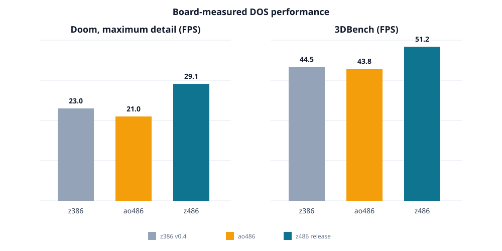

# z386 - an 80386-class FPGA CPU built around original microcode

z386 is an 80386-compatible CPU core written in SystemVerilog and built around the original Intel 386 microcode. Instead of implementing each x86 instruction as a separate RTL behavior, z386 implements the hardware structures the microcode expects to control: instruction prefetch, decode, the microcode sequencer, segmentation, paging, protection checks, ALU, shifter, and bus access.

The project is intended as an educational reconstruction and a reusable
embedded x86 CPU core.

For the faster 80486-class successor with a pipelined design, faster frontend,
hardwired common instructions, and an integrated x87 unit, see
[z486](https://github.com/nand2mario/z486). The current MiSTer PC core is
[z486_MiSTer](https://github.com/nand2mario/z486_MiSTer).

## Performance

### Dhrystone 2.1

All three x86 cores execute the same i386 binary. z386 and z486 use matched
8 KB instruction and 8 KB data caches; ao486 retains its native cache
organization. ALMs are standalone seed-1 fits on the DE10-Nano Cyclone V using
the same z486_MiSTer production settings.

| Core | DMIPS/MHz | CPI | Cyclone V ALMs |
| --- | ---: | ---: | ---: |
| z386 | 0.225 | 4.101 | 15,545 |
| ao486 | 0.194 | 4.556 | 15,190 |
| **z486** | **0.330** | **2.800** | **21,906** |

The z486 area includes its experimental x87 unit. With x87 disabled, z486 uses
16,329 ALMs, only 5.0% more than z386. DMIPS/MHz is the primary performance
metric; ao486 counts retirement at a different pipeline boundary, so its CPI
is less directly comparable.

### DOOM

These are board measurements using each core's native release configuration:
85 MHz for z386 and z486, and 90 MHz for ao486. The z386 v0.4 result uses its
release 16 KB instruction and 16 KB data caches, whereas the Dhrystone
comparison above uses matched 8 KB + 8 KB configurations for z386 and z486.

The complete methodology and analysis are in the
[z486 technical report](https://nand2mario.github.io/posts/2026/z486/).

The z386 L1 cache size is tunable through the `DCACHE_SET_BITS` and
`ICACHE_SET_BITS` parameters.

To learn more about the 80386 microcode, read [80386 microcode disassembled](https://www.reenigne.org/blog/80386-microcode-disassembled/).

I also wrote a blog series analyzing the 386 microarchitecture and documenting the process of building z386:

* [80386 Multiplication and Division](https://nand2mario.github.io/posts/2026/80386_multiplication_and_division/)
* [80386 Barrel Shifter](https://nand2mario.github.io/posts/2026/80386_barrel_shifter/)
* [80386 Protection](https://nand2mario.github.io/posts/2026/80386_protection/)
* [80386 Memory Pipeline](https://nand2mario.github.io/posts/2026/80386_memory_pipeline/)
* [z386: An Open-Source 80386 Built Around Original Microcode](https://nand2mario.github.io/posts/2026/z386/)
* [80386 Early Start Memory Access](https://nand2mario.github.io/posts/2026/80386_early_start/)

z386 was written by nand2mario. It builds on Intel 386 microcode disassembly and silicon reverse-engineering work by [reenigne](https://www.reenigne.org/blog/), [gloriouscow](https://github.com/dbalsom), [smartest blob](https://github.com/a-mcego), and [Ken Shirriff](https://www.righto.com/).

## License

Copyright 2026 nand2mario. The SystemVerilog, Python, and Markdown files
(`*.sv`, `*.svh`, `*.py`, and `*.md`) are licensed under the
[Apache License 2.0](LICENSE). 
See [License Scope](LICENSE-SCOPE.md) for details.
